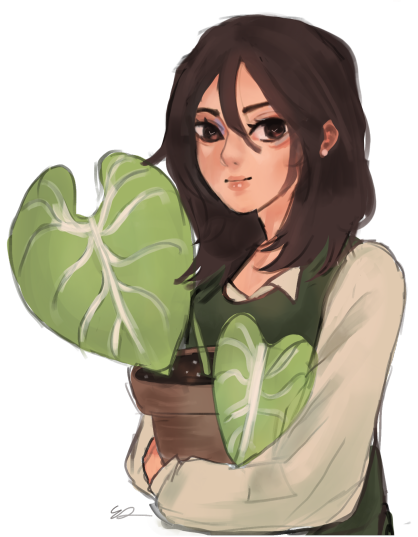

# 🌿🌿 Hello there! I'm Liz. 🌿🌿

#### Welcome to my workspace!
[My portfolio](https://lizzzshan-portfolio.carrd.co/) - [LinkedIn](https://www.linkedin.com/in/elizabeth-shan-776b13183/) - [Devpost](https://devpost.com/lizzzshan?ref_content=user-portfolio&ref_feature=portfolio&ref_medium=global-nav) 

I'm currently taking the [Fullstack-open](https://github.com/lizzzshan/fullstack-open) course on my free time. More projects coming soon!

# 🌿My projects
* [Planthurium: An anthuriums market](https://github.com/lizzzshan/Planthurium)
* [Oblong food classifier ML](https://github.com/lizzzshan/oblong-food-classifier)
* [T9 HACKS 2022 WINNER: The Planeteers](https://the-planeteers.github.io/the-planeteers/)
